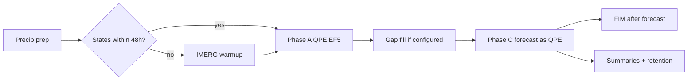

# TITO Antigua and Barbuda — Operational Flash Flood Forecasting

**TITO (Threading Inputs to Outputs)** runs the **EF5** hydrologic model with satellite QPE, ensemble nowcasting/QPF and flood inundation mapping for **Antigua and Barbuda**.

This is the production deployment package for the Antigua and Barbuda domain (30m).

[](CHANGELOG.md)
[](https://www.python.org/)
[](https://github.com/astral-sh/ruff)
[](https://github.com/AHWALab/TITOCaribbeanAndComoros/actions/workflows/ci.yml)
[](https://github.com/AHWALab/TITOCaribbeanAndComoros/actions/workflows/docker.yml)
[](#1-build-the-images)

---

## Domain defaults

| | |
|--|--|
| Region | `Antigua` |
| Resolution | `30m` |
| QPE / QPF | IMERG / AROME |
| Cycle chain | IMERG + SCaMPR gap + AROME |
| FIM | 30 m, 7 ADM1 unit sites |
| IBF | enabled (ibf_data/Antigua) |
| Control template | `EF5_conf/templates/ef5_Antigua_30m_control_template.txt` |
| Hindcast example | `2025-10-10 01:00` |

- Operational QPE is IMERG with SCaMPR gap-fill (`qpe_gap_fill_mode = IMERG_SCAMPR`), then AROME as QPE for the forecast phase.
- FIM runs at 30 m after the forecast phase.
- IBF receptor data ships under `ibf_data/Antigua/`.

Warmup precipitation is **always IMERG** (never HSAF), for every region.

---

## 1. Build the images

Build **locally first**. Do not ship a docker image tar; each site creates its own images.

```bash
# TITO image + EF5 image (Docker). 10–15 minutes the first time.
./container-build.sh
```

Useful flags: `./container-build.sh --no-ef5` (TITO only), `--no-cache`.

### Apptainer / Singularity environments

After the Docker images exist, convert them:

```bash
./docker-to-apptainer.sh
```

This produces `tito.sif` (and uses `EF5/bin/ef5` inside the SIF — no nested Apptainer). Then:

```bash
TITO_RUNTIME=apptainer ./tito-run.sh operational --regions Antigua
```

HPC helper: `./sif_convert_on_argon.sh`.

---

## 2. Run

```bash
# One operational cycle
./tito-run.sh operational --regions Antigua

# Hourly cron (hh:05 UTC)
./manage_cron.sh install
./manage_cron.sh status
./manage_cron.sh run
./manage_cron.sh remove

# Hindcast
./tito-run.sh hindcast "2025-10-10 01:00" "2025-10-10 01:00" --regions Antigua

# Shell inside the runtime
./tito-run.sh shell
```

Windows CMD: `tito-run.cmd operational --regions Antigua`.

---

## Pipeline



Retention: states 100 h, outputs 24 h, logs 100 h (`Caribbean_Comoros_config.py`).

---

## EF5 configuration (`EF5_conf/`)

### `basic/`
DEM/FAC/FDIR_antigua_30m.tif (90 m grids also present) — DEM, flow accumulation, flow direction. Injected as `{dem}`, `{ddm}`, `{fam}`.

### `parameters/`
CREST_Antigua_30m/, KW_Antigua_30m/ — CREST (`wm_grid`, `b_grid`, `fc_grid`, `im_grid`) and kinematic wave (`alpha_grid`, `beta_grid`, `alpha0_grid`).

### `pet/`
`PET.01.tif` … `PET.12.tif` monthly climatology (mm/d).

### `templates/`
`ef5_Antigua_30m_control_template.txt` plus `basin_list/`. Job builders fill `{TIMEBEGIN}`, `{TIMEWARMEND}`, `{TIMESTATE}`, `{TIMEEND}`, `{OUTPUTPATH}`, `{STATESPATH}`.

### `states/`
Chained per product, 48 h lookback, warmup ends at T−40 h:

```text
EF5_conf/states/
  stream_sat/ensS<N>/antigua_30m/
  scampr/ensS<N>/...
  hsaf/...
  imerg/antigua_30m/
```

### `precip/` and `precipEF5/`
Live staging, wiped after the cycle when `clear_precip_after_cycle = True`.

### `qpf_store/`
`antigua/gfs_data/`, `stormlab_data/ensQ<N>/`, `arome_data/` as applicable.

EF5 runtime: Docker sibling `ef5-container:latest` or Apptainer local `EF5/bin/ef5`.

---

## Outputs

```text
outputs/<YYYYMMDD.HHMMSS>/antigua_30m/
  <product>/          # imerg, stream_sat, scampr, stormlab, hsaf, arome, gfs
  summary/
  fim/<chain>/
logs/
  tito_hourly_<UTC>.log
  pipeline_<cycle>.log
```

FIM one-time: `python fim_store/unzip_stores.py Antigua`

---

## CI/CD

| Workflow | Trigger |
|----------|---------|
| `.github/workflows/ci.yml` | push `TITO_Antigua` / `main`, PRs — ruff 0.16.3, shellcheck, pytest |
| `.github/workflows/docker.yml` | container input changes — TITO + EF5 image smoke tests |
| `.github/workflows/release.yml` | `v*` tag — `ghcr.io/<owner>/<repo>/tito-antigua` |

```bash
ruff check . && ruff format --check .
python -m pytest -q
pre-commit install
```

---

## Security

Override credentials with env vars: `TITO_SMTP_*`, `TITO_HSAF_FTP_*`, `TITO_GPM_EMAIL`, `TITO_IMERG_SERVER`. Do not commit real passwords.

---

## Troubleshooting

| Symptom | Fix |
|---------|-----|
| EF5 exit 137 | OOM — lower `ef5_max_workers` |
| EF5 exit 127 | Rebuild TITO image (`./container-build.sh --no-ef5`) |
| Cron skipped | `./manage_cron.sh status` — lock still held |
| Missing states | Check 48 h lookback and UTC clock |
| FIM skipped | Wrong resolution (FIM is 30m only for this domain) |

## Cite

Robledo Delgado, V., & Vergara, H. (2025). Threading Inputs to Outputs (TITO) (v2.0.0). Zenodo. https://doi.org/10.5281/zenodo.17246491

## Contact

Naman Mehta — naman-mehta@uiowa.edu
Vanessa Robledo — vanessa-robledodelgado@uiowa.edu
AHWA Laboratory — https://ahwa.lab.uiowa.edu/ — engr-ahwa-lab@uiowa.edu
