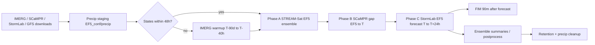

# TITO Guatemala — Operational Flash Flood Forecasting

**TITO (Threading Inputs to Outputs)** runs the **EF5** distributed hydrologic model with satellite QPE, ensemble nowcasting/QPF and scenario-library flood inundation mapping for **Guatemala**, in hourly operational cycles at **90 m and 900 m**.

This is the production deployment package for the Guatemala domain. It orchestrates precipitation preparation, EF5 ensemble runs, FIM, ensemble summaries, retention, and hourly scheduling — inside Docker or Apptainer, with no PyTorch/CUDA.

[](CHANGELOG.md)
[](https://www.python.org/)
[](https://github.com/astral-sh/ruff)
[](https://github.com/AHWALab/TITOCaribbeanAndComoros/actions/workflows/ci.yml)
[](https://github.com/AHWALab/TITOCaribbeanAndComoros/actions/workflows/docker.yml)
[](#runtime-options)

---

## Contents

- [What a cycle produces](#what-a-cycle-produces)
- [Pipeline](#pipeline)
- [Runtime options](#runtime-options)
- [Quick start](#quick-start)
- [Hourly operations](#hourly-operations)
- [Configuration reference](#configuration-reference)
- [EF5 configuration (`EF5_conf/`)](#ef5-configuration-ef5_conf)
- [Output layout](#output-layout)
- [Flood inundation mapping (FIM)](#flood-inundation-mapping-fim)
- [IBF receptor products (optional)](#ibf-receptor-products-optional)
- [Offline mode](#offline-mode)
- [Maintenance and recovery](#maintenance-and-recovery)
- [CI/CD and releases](#cicd-and-releases)
- [Troubleshooting](#troubleshooting)
- [Security](#security)
- [References](#references)

---

## What a cycle produces

| Chain | QPE (Phase A) | Gap fill (Phase B, ops only) | Forecast (Phase C) | EF5 products |
|-------|---------------|------------------------------|--------------------|--------------|
| **STREAM-Sat + StormLab** (default) | STREAM-Sat ensemble over `T−48h → ss_end` (≈ `T−4h`) | SCaMPR QPE `ss_end → T`, states saved | StormLab ensemble QPE `T → T+24h`, no states | `stream_sat/ensOutN`, `scampr`, `stormlab/ensOutN_slM` |
| **IMERG + GFS** (alternate) | IMERG QPE → `T−4h`, states saved | SCaMPR QPE `T−4h → T`, no states | GFS QPE `T → T+24h`, no states | `imerg`, `gfs` |

Per cycle, for each `(region, resolution)` pair in `region_resolution_map` (Guatemala runs **900 m then 90 m** in one invocation, sharing a single precipitation preparation):

1. **Warmup** (only when no states are found within the 48 h lookback): IMERG precipitation over `warmup_days`, ending at `T−40h`.
2. **Phase A** — STREAM-Sat (or IMERG) ensemble EF5 run; states saved per member.
3. **Phase B** — SCaMPR gap-fill EF5 run `→ T` (operational only); states saved.
4. **Phase C** — StormLab (or GFS) forecast-as-QPE EF5 ensembles; no state save.
5. **STEP 8 — FIM** after the forecast phase, **90 m sites only**.
6. **Postprocess** — ensemble `min/median/max` grids for `qpeaccum`, `maxunitq`, `maxsm` under `summary/`.
7. **Archive** — states older than `states_keep_hours` and cycle folders older than `outputs_keep_hours` are purged.

## Pipeline



Contributors: Vanessa Robledo, Humberto Vergara, Naman Mehta (AHWA Lab, University of Iowa).

---

## Runtime options

Partners need **either Docker or Apptainer/Singularity — not both**.

| Runtime | EF5 execution | Requirements |
|---------|---------------|--------------|
| **Docker** (default) | `ef5-container:latest` sibling container via `/var/run/docker.sock` | Docker Engine / Docker Desktop, ~8 GB+ host RAM, images in `dist/docker-archives/` or built locally |
| **Apptainer / Singularity** | local glibc `EF5/bin/ef5` inside `tito.sif` (no nested containers) | `tito.sif` (2.5 GB) + `EF5/bin/ef5`, `libtiff`/`libgeotiff`/`libgomp` in the SIF |
| **Native conda** (dev only) | `EF5/bin/ef5` or `EF5/ef5-container.sif` | conda env `tito_env2` from `tito_env.yml` |

The launcher auto-detects the runtime; override with `TITO_RUNTIME=docker|apptainer|singularity|native`.

## Quick start

```bash
cd Deployment_versions/Guatemala

# 1. Provide images (once). Either load pre-built archives from dist/...
./tito-run.sh load-images

# ...or build them from source (Docker + 10–15 min):
./container-build.sh            # TITO + EF5 Docker images
./container-build.sh --sif      # also convert to Apptainer .sif (needs apptainer)

# 2. Run one operational cycle for Guatemala
./tito-run.sh operational --regions Guatemala

# 3. (HPC / no Docker) same cycle with Apptainer
TITO_RUNTIME=apptainer ./tito-run.sh operational --regions Guatemala

# Interactive shell inside the runtime
./tito-run.sh shell
```

Windows CMD equivalents (pure CMD, no PowerShell): `tito-run.cmd operational --regions Guatemala`, `load-docker-images.cmd`.

Hindcast over a date range (state-chained hour by hour):

```bash
./tito-run.sh hindcast "2026-07-22 00:00" "2026-07-22 06:00" --regions Guatemala
```

## Hourly operations

`manage_cron.sh` installs and supervises the hourly operational cycle (`hh:05 UTC`, configurable at the top of the script):

```bash
./manage_cron.sh install   # add the crontab entry
./manage_cron.sh status    # cron state + last log tail
./manage_cron.sh run       # run one cycle now (same as cron)
./manage_cron.sh remove    # remove the crontab entry
```

Operational guardrails built into the scheduler:

- **Single-flight**: a `flock` lock (`outputs/logs/tito_cron.lock`) plus a process/container check skips a new cycle while a previous one is still running.
- **Per-run log**: every cron invocation tees to `outputs/logs/tito_hourly_<UTC timestamp>.log`; the orchestrator writes `outputs/logs/pipeline_<cycle>.log` and per-EF5-job logs under `outputs/<cycle>/<region_res>/`.
- **Retention**: `states_keep_hours = 100`, `outputs_keep_hours = 24` (enforced by `tito_utils/postprocess/archive_manager.py`).
- **Precip cleanup**: `clear_precip_after_cycle = True` wipes `EF5_conf/precip`, `EF5_conf/precipEF5`, `EF5_conf/qpf_store` inputs after the cycle; states and outputs are kept.

Console verbosity: `console_verbosity = "user"` in the config, `TITO_CONSOLE_VERBOSITY=debug`, or `--debug-console` on the orchestrator for full developer logs.

## Configuration reference

Everything lives in `Caribbean_Comoros_config.py` (imported as a Python module by `orchestrator.py`).

| Setting | Default | Purpose |
|---------|---------|---------|
| `region_resolution_map` | `{"Guatemala": ["900m", "90m"]}` | Resolutions run in order in one cycle; precip is prepared once. A single string also works. |
| `regions_to_run` | `["Guatemala"]` | Regions for this deployment. |
| `region_forcing_map` | `{"Guatemala": {"qpe_source": "STREAM_SAT", "qpf_source": "STORMLAB"}}` | Per-region QPE/QPF chain; QPF may be a list (Cartesian product). |
| `stream_sat_ensemble_size` / `stormlab_ensemble_size` | `10` / `5` | Ensemble members (STREAM-Sat Phase A, StormLab Phase C). |
| `ef5_max_workers` | `12` | Parallel EF5 jobs. Lower it on memory-constrained hosts (OOM = exit 137). |
| `stream_sat_gap_fill_mode` | `"SCAMPR"` | Phase B gap product for the STREAM-Sat chain (`SCAMPR` / `HSAF` / `NONE`). |
| `warmup_enabled` / `warmup_days` | `True` / `90` | Cold-start warmup; precipitation source from `warmup_precip_source_map` (always IMERG). |
| `run_LR` / `LR_timestep` / `dry_run_hours` | `True` / `"60u"` / `6` | Forecast phase, long-range timestep, dry tail after the forecast. |
| `states_keep_hours` / `outputs_keep_hours` | `100` / `24` | Retention for states and cycle output folders. |
| `statesPath`, `precipEF5Folder`, `qpf_store_path`, `dataPath` | `EF5_conf/...`, `outputs/` | Storage roots (see next section). |
| `modelStates` | `crest_SM`, `kwr_IR`, `kwr_pCQ`, `kwr_pOQ` | EF5 state variables chained between cycles. |
| `SEND_ALERTS` / `alert_recipients` | `False` / placeholders | SMTP alerting (credentials via env, see [Security](#security)). |
| `fim_enabled` / `fim_regions` | `True` / Guatemala 90 m | Scenario-library FIM after the forecast phase. |
| `HindCastMode` | `False` | `True` + `HindCastDate`/`HindCastEndDate` for historical re-runs. |

EF5 runtime knobs: `EF5_RUNTIME=docker|local`, `EF5_IMAGE` (default `ef5-container:latest`), `EF5_LOCAL_BIN` (default `EF5/bin/ef5`), `EF5_OMP_NUM_THREADS=1`.

## EF5 configuration (`EF5_conf/`)

### `EF5_conf/basic/` — terrain grids

| File | Role |
|------|------|
| `DEM_guatemala_90m.tif`, `DEM_guatemala_900m.tif` | Digital elevation model per resolution |
| `FAC_guatemala_90m.tif`, `FAC_guatemala_900m.tif` | Flow accumulation |
| `FDIR_guatemala_90m.tif`, `FDIR_guatemala_900m.tif` | Flow direction |

These are injected into the control file as `{dem}`, `{ddm}`, `{fam}` placeholders; grid names must stay in sync with the parameters below.

### `EF5_conf/parameters/` — model parameters

| Folder | Files | Control-file keys |
|--------|-------|-------------------|
| `CREST_Guatemala_90m/`, `CREST_Guatemala_900m/` | `crest_Wm_ef5.tif`, `crest_b_ef5.tif`, `crest_Fc_Ksat_ef5.tif`, `GTM_IM_final.tif` | `wm_grid`, `b_grid`, `fc_grid`, `im_grid` |
| `KW_Guatemala_90m/`, `KW_Guatemala_900m/` | `KW_alpha_PINN-v02_FL.tif`, `KW_beta_PINN-v02_FL.tif`, `KW_alpha0_v2.tif` | `alpha_grid`, `beta_grid`, `alpha0_grid` |

Every resolution in `region_resolution_map` must have a matching parameter set, or EF5 will fail at control-file prep.

### `EF5_conf/pet/` — PET climatology

`PET.01.tif` … `PET.12.tif` — monthly climatological potential evapotranspiration (mm/d), referenced by `[PETForcing CLIMO]` with `NAME=PET.MM.tif` and `FREQ=1m`.

### `EF5_conf/templates/` — EF5 control templates

| File | Use |
|------|-----|
| `ef5_Guatemala_90m_control_template.txt` | 90 m control file skeleton |
| `ef5_Guatemala_900m_control_template.txt` | 900 m control file skeleton |
| `basin_list/Guatemala_90m_basin_new.txt`, `basin_list/Guatemala_900m_basin_new.txt` | Gauge-basin routing lists |

Each template contains the forcing definitions (`[PrecipForcing IMERG|GFS|STORMLAB|WRF]`, `[PETForcing CLIMO]`), parameter sets (`[CrestParamSet MyCRESTPAR]`, `[kwparamset MyKWPAR]`), and the QPE/QPF simulations (`[Task Simulation_QPE]` → `[Task Simulation_QPF]`). At runtime the job builders fill `{TIMEBEGIN}`, `{TIMEWARMEND}`, `{TIMESTATE}`, `{TIMEEND}`, `{TIMESTEPLR}`, `{TIMEBEGINLR}`, `{OUTPUTPATH}`, `{STATESPATH}` and the grid placeholders, and write the final control file into the staging folder. `TIME_WARMEND`/`TIME_STATE` are placed at `T−40h` on cold start; for warm-started runs they are commented out.

### `EF5_conf/states/` — chained hydrologic states

State files are named `<var>_<YYYYMMDD>_<HHMM>.tif` (e.g. `crest_SM_20260910_1830.tif`) and are organized **per product** so chains never mix:

```text
EF5_conf/states/
  stream_sat/ensS<N>/guatemala_90m/     # STREAM-Sat Phase A states  (≈ T−4h)
  stream_sat/ensS<N>/guatemala_900m/
  scampr/ensS<N>/guatemala_90m/         # SCaMPR gap states          (T)
  scampr/ensS<N>/guatemala_900m/
  imerg/guatemala_90m/                  # IMERG chain states         (T−4h)
  guatemala_90m/, guatemala_900m/       # warmup / direct-QPE states
```

Chaining rules (enforced by `tito_utils/cycle/timeline.py`):

- The next cycle searches **back 48 h** from `T` for the most recent state.
- Operational STREAM-Sat: Phase C starts from **SCaMPR gap states at `T`**; the re-run Phase A starts from **STREAM-Sat states at ≈ `T−4h`**.
- Hindcast: Phase A states are saved at `T` (no IMERG latency) and used directly by the next hour.
- StormLab/GFS forecast runs **never save states**.
- Old state TIFFs are deleted after `states_keep_hours` (100 h) by the archive step; **state folders are never deleted**.

### `EF5_conf/precip/` — live precipitation staging

Runtime mirrors for the current cycle: `stream_sat/` (`caribbean/` domain + `guatemala/`), `stormlab/`, `scampr/`, `imerg/`, `hsaf/`, plus `_shared/`. Contents are removed after each cycle when `clear_precip_after_cycle = True`.

### `EF5_conf/precipEF5/` — per-run EF5 inputs

One staging folder per `(region, resolution)` (e.g. `guatemala_90m/`), holding the generated control file and the precip TIFs renamed to what the control template expects (`imerg.qpe.YYYYMMDDHHUU.30minAccum.tif`, etc.). Wiped at the start of every cycle.

### `EF5_conf/qpf_store/` — forecast forcing store

`guatemala/gfs_data/` and `guatemala/stormlab_data/ensQ<N>/` (plus `arome_data/`, `wrf_data/` for other QPF sources) hold the forcing GeoTIFFs referenced by `LOC=qpf_store/...` in the templates. `_shared/` caches per-cycle shared downloads, and `EF5_conf/qpf_store/archive/` (`QPF_archive_path`) holds longer-lived forcing archives.

### EF5 binary and images

- Docker: `EF5_RUNTIME=docker` → `ef5-container:latest` spawned as sibling containers through the mounted Docker socket (`EF5_OMP_NUM_THREADS=1`).
- Apptainer: `EF5_RUNTIME=local` → `EF5/bin/ef5` glibc binary inside `tito.sif` (built by `EF5/docker/build_ef5_local.sh`; **no nested Apptainer**).
- EF5 sources/build: `EF5/docker/Dockerfile` (container) and `EF5/docker/Dockerfile.ubuntu`.

## Output layout

Cycle-first: every product of a cycle lives under `outputs/<YYYYMMDD.HHMMSS>/<region>_<res>/`:

```text
outputs/20260912.210000/
  guatemala_900m/
    stream_sat/ensOut1..N/          # Phase A grids + logs
    scampr/                         # Phase B gap grids
    stormlab/ensOutN_slM/           # Phase C StormLab ensembles
    summary/                        # qpeaccum|maxunitq|maxsm _nowcast|forecast _min|median|max
    fim/<chain>/                    # e.g. fim/stream_sat_stormlab/
  guatemala_90m/                    # same, plus FIM (90 m only)
logs/
  tito_hourly_<UTC>.log             # cron run log
  pipeline_<cycle>.log              # orchestrator master log
```

`outputs_keep_hours = 24` removes old cycle folders during the archive step; keep a longer window if products are consumed downstream.

## Flood inundation mapping (FIM)

FIM runs **after the forecast phase**, for **90 m** sites only, triggered per site YAML in `fim_config/`. Rain totals come from `qpeaccum` components (never `qpfaccum`), and failures are non-fatal. Full details: [README_FIM.md](README_FIM.md).

One-time store setup:

```bash
python fim_store/unzip_stores.py Guatemala     # joins split parts if needed, unzips .zarr
```

Current sites:

| YAML | Site | Hazards |
|------|------|---------|
| `fim_config/Guatemala_SantaInesPetapa.yaml` | Santa Ines Petapa (cuenca Villalobos) | pluvial + fluvial + combined |
| `fim_config/Guatemala_Morales.yaml` | Morales (Rio Motagua) | prepared, `enabled: false` until its store ships |

Add a site by dropping `<Region>_<Site>.yaml` in `fim_config/` (see `fim_config/README.md` and `fim_config/examples/`); matching `<Region>*.yaml` files are picked up automatically.

## IBF receptor products (optional)

When `fim_config/ibf/<Site>_ibf.yaml` exists, the FIM hook also runs the IBF pipeline (`tito_utils/ibf_utils/`) and writes receptor-level products (buildings/roads/admin GPKG + summary CSV). Without that YAML the step logs `no fim_config/ibf/... , skip` and continues. Guatemala currently has no IBF YAML, so only FIM products are produced.

## Offline mode

Air-gapped validation without downloads, driven by the pre-staged `offline_precips/` archive:

```bash
./tito-run.sh hindcast "2023-06-21 07:00" "2023-06-21 08:00" --regions Guatemala --offline
```

The archive is refreshed from a good online run with `bash offline/materialize_offline_precips.sh`; see [offline/README.md](offline/README.md). Offline mode refuses timestamps outside the staged archive and never changes online behavior.

## Maintenance and recovery

| Task | Command |
|------|---------|
| Cron status + last log | `./manage_cron.sh status` |
| Run a cycle manually | `./manage_cron.sh run` |
| Restore training snapshot (Guatemala course data only) | `./reset_tito.sh --dry-run` then `./reset_tito.sh` |
| Full destructive wipe (outputs, states, precip, QPF store) | `DRY_RUN=1 ./cleanup_outputs.sh` then `DRY_RUN=0 ./cleanup_outputs.sh` |
| Rebuild containers | `./container-build.sh [--sif] [--no-ef5] [--no-cache]` |
| Docker → Apptainer SIF | `./docker-to-apptainer.sh` (or `./sif_convert_on_argon.sh` on HPC) |
| Save images for USB distribution | `./docker-save-archives.sh` |

`reset_tito.sh` is specific to the fixed training snapshot (keeps state TIFFs for `2023-06-19 15:00`, refuses to delete when none are found). For a production outage, prefer keeping the last good states: re-run the failed cycle after the scheduler releases its lock — warmup/state lookback handles the rest.

## CI/CD and releases

| Workflow | Trigger | What it does |
|----------|---------|--------------|
| `.github/workflows/ci.yml` | push to `main`/`TITO_Guatemala`, PRs | `ruff check` + `ruff format --check` (pinned 0.16.3), `shellcheck` on all launchers, `pytest` on Python 3.12 |
| `.github/workflows/docker.yml` | changes to container inputs | Builds `tito:ci` and `ef5-container:ci` with layer cache; import smoke test and EF5 binary check |
| `.github/workflows/release.yml` | `v*` tag | Pushes `ghcr.io/<owner>/<repo>/tito-guatemala:<version>` (provenance + SBOM) and creates a GitHub release |

Local checks (same versions as CI):

```bash
ruff check . && ruff format --check .
python -m pytest -q
pre-commit install   # optional: run the same checks on commit
```

Dependabot (`.github/dependabot.yml`) opens weekly updates for GitHub Actions, Docker, and Python dependencies. Version bumps live in `pyproject.toml` and `CHANGELOG.md`; tag `vX.Y.Z` to publish.

## Troubleshooting

| Symptom | Likely cause / fix |
|---------|--------------------|
| EF5 exit **137** | OOM — lower `ef5_max_workers`, use 900 m first, raise Docker/Apptainer memory |
| EF5 exit **127** | Missing `libtiff.so.5` / `libgeotiff` for the local EF5 binary — rebuild the TITO image (`./container-build.sh --no-ef5`) |
| `Cannot open TIFF` after STREAM-Sat | Corrupt GeoTIFFs from memory pressure — wipe `EF5_conf/precip/stream_sat` and re-run |
| `docker load` 502 | Docker Desktop not fully started — restart the daemon |
| FIM `no_runs` | Chain folder mismatch or non-90 m resolution — check `outputs/<cycle>/<rkey>/stormlab` vs `gfs` |
| FIM skipped for 900 m | Expected — FIM is 90 m only |
| Cycle skipped by cron | Another cycle holds `outputs/logs/tito_cron.lock` or is still running (`manage_cron.sh status`) |
| Missing states / warmup every cycle | State timestamps outside the 48 h lookback — check `EF5_conf/states/...` contents and system clock (UTC) |
| Offline refused cycle | Timestamp not present in the staged `offline_precips/` archive |

## Security

- **Never commit real credentials.** SMTP, HSAF FTP, and GPM values in `Caribbean_Comoros_config.py` are placeholders; override them with environment variables:
  `TITO_SMTP_USER`, `TITO_SMTP_PASSWORD`, `TITO_SMTP_SERVER`, `TITO_SMTP_PORT`, `TITO_HSAF_FTP_USER`, `TITO_HSAF_FTP_PASS`, `TITO_GPM_EMAIL`, `TITO_IMERG_SERVER`.
- For CI/CD secrets (registry, deployment), use GitHub Actions secrets and environment protection — never config files.
- The Docker image runs as root and mounts `/var/run/docker.sock` (needed to spawn EF5 siblings); run it only on hosts where that trust level is acceptable.
- Large data (states, outputs, stores) is gitignored; GeoTIFFs and store zips are tracked through Git LFS where required.

## References

- Li, Z., et al. (2023). STREAM-Sat / satellite QPE ensemble. *Water Resources Research*.
- Hartke, S., et al. (2022). Related satellite precipitation ensemble work.
- Liu, G., Wright, D. B., & Lorenz, D. (2024). StormLab. Peng, B., et al. (2025). StormLab / GEFS applications.
- EF5: [AHWALab/EF5-builder-toolkit](https://github.com/AHWALab/EF5-builder-toolkit)
- FIM details: [README_FIM.md](README_FIM.md) · FIM sites: [fim_config/README.md](fim_config/README.md)

## Cite

Robledo Delgado, V., & Vergara, H. (2025). Threading Inputs to Outputs (TITO) (v2.0.0). Zenodo. https://doi.org/10.5281/zenodo.17246491

## Contact

Naman Mehta — naman-mehta@uiowa.edu
Vanessa Robledo — vanessa-robledodelgado@uiowa.edu
AHWA Laboratory — [ahwa.lab.uiowa.edu](https://ahwa.lab.uiowa.edu/) — engr-ahwa-lab@uiowa.edu
